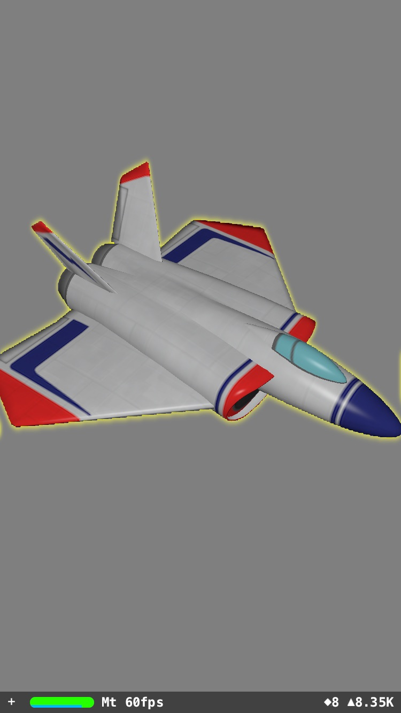

# SCNTechniqueGlow

Very basic example of drawing a glow outline around a SceneKit node.
Uses SCNTechnique with Metal shaders.

Code quality not guaranteed.

Based on / inspired by these nice SCNTechnique examples.
https://github.com/lachlanhurst/SCNTechniqueTest
https://github.com/kosua20/Technique-iOS

## ARKit Usage

Update [Main.storyboard](SCNTechniqueGlow/Base.lproj/Main.storyboard) to launch [ViewController](SCNTechniqueGlow/ViewController.swift) to view the ARSCNView demo.

## FAQ
### How do I make the blur larger? 
For now you will have to manually add blur passes in NodeTechnique.plist. Check the 'sequence' key. This is where the blur passes are defined. Each blur stage requires two blur passes: a horizontal + vertical pass. So make sure to add 'pass_blur_h' along with 'pass_blur_v' or you will end up with an uneven glow. 

### How do I change the blur color? 

You can pass the color from swift into the metal shader when setting up the technique [here](https://github.com/laanlabs/SCNTechniqueGlow/blob/master/SCNTechniqueGlow/GameViewController.swift#L86). It should look something like this:

    let color = SCNVector3(1.0, 1.0, 0.0)
    technique.setValue(NSValue(scnVector3: color), forKeyPath: "glowColorSymbol")

## Author

This project was created by Laan Labs. We design and build solutions at the intersection of Computer Vision and Augmented Reality.

[http://labs.laan.com](http://labs.laan.com)

[@laanlabs](https://twitter.com/laanlabs)

## License

SCNTechniqueGlow is released under the MIT License. See [LICENSE](LICENSE) for details.
